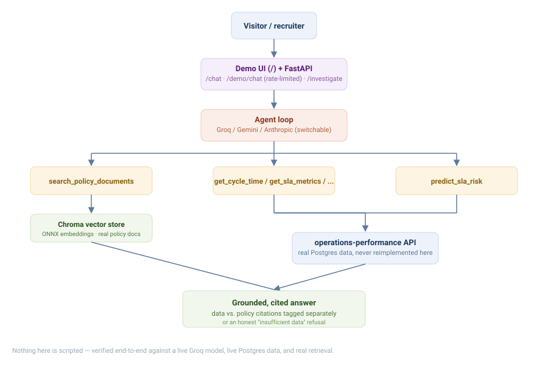

# Operations Assistant


**🔗 [Live demo](https://operations-assistant.onrender.com)** — ask a real question, get a real
answer from a real Groq-backed agent over live data and real policy documents. Free-tier hosting,
so the first request after idling may take 30-60s to wake up.

An operations investigation assistant for **Northstar Manufacturing** that combines enterprise
documents (policies/SOPs), operational data, process analytics, and predictive SLA-risk scores to
answer business questions and conduct evidence-based investigations — grounded, cited, and
willing to say "insufficient data" rather than guess.

**Key numbers at a glance:**

| What | Number | How measured |
|---|---|---|
| Hybrid retrieval Hit@1 | **69.2%** | 91 in-scope questions, section-level match, deployed config |
| Hybrid retrieval MRR | **0.770** | same eval set; with optional cross-encoder reranker: Hit@1 78.0%, MRR 0.840 |
| Faithfulness gate pass rate | **89.7%** (at `t=0.5`) | NLI scoring via `cross-encoder/nli-deberta-v3-small` |
| Agent tool-selection | **25/25 (100%)** | 25 hand-written questions, 6 categories, mechanical evaluation |
| Provider count | **4** | Anthropic, Groq, Gemini, LangChain — one interface |

The distinguishing piece is the **faithfulness gate** ([§Grounded answer gate](#grounded-answer-gate-srcretrievalgrounded_searchpy)): after retrieval and generation, NLI scoring decides whether the LLM's answer is entailed by the retrieved chunks. If not, the gate fires and returns "insufficient information" rather than a hallucinated answer. This directly addresses the paraphrase-question failure mode (0% faithfulness without gating) and is evaluated at multiple thresholds with real numbers.

Consumes the data model and analytics built in [`operations-performance`](../operations-performance)
via a small set of controlled tools rather than re-implementing that logic.

## Knowledge base

The RAG layer indexes 4 synthetic Northstar Manufacturing policy/SOP documents
([`data/documents/`](data/documents/)) — `procurement-policy.md`, `sla-policy.md`,
`escalation-procedure.md`, `exception-handling-procedure.md` — each split into
section-level chunks by markdown heading (`##`/`#`), so a chunk boundary always
lines up with a real section, not an arbitrary character count. Small on purpose:
this is a portfolio-scale RAG target, not a claim of enterprise document volume —
see [Retrieval evaluation](#retrieval-evaluation) below for how retrieval quality
was actually measured against it, not just assumed.

## Stack
Python · FastAPI · PostgreSQL · RAG (ChromaDB + hybrid BM25/semantic retrieval) ·
LangChain · Groq / Anthropic / Gemini · Docker · Render

Containerised; deployable as a Kubernetes `Deployment` behind a `ClusterIP` `Service` — the
one stateful piece (`data/conversations.db`, SQLite) is the reason a real cluster deployment
would swap that for a shared store first, noted here rather than glossed over.

## Agent orchestration
Four interchangeable providers behind one interface (`config["provider"]`, switchable
via `AGENT_PROVIDER` without touching code): Anthropic, Groq, Gemini, and
**LangChain** (`src/agent/langchain_agent.py`) — the LangChain path wraps this
project's real tools as `StructuredTool` objects (schema inferred from the actual
function signatures, not a hand-copied duplicate) and drives them through
`ChatGroq.bind_tools()`. Every provider calls the exact same underlying tool
functions and returns the same response shape, so switching orchestration layers
never changes what a tool actually does.

**Provider comparison, benchmarked, not just enumerated:** ran the same 3
questions (a data-tool question, a document-retrieval question, and an
unanswerable one) through each live provider path. Groq direct and LangChain
(Groq-backed via `ChatGroq.bind_tools()`) both selected the correct tool on
every question and handled the unanswerable one correctly (no tool call,
honest refusal):

| Provider | Avg latency (3 q) | Correct tool selection | Real cost (3 q, from `config/pricing.yaml`) |
|---|---|---|---|
| Groq (`openai/gpt-oss-120b`, direct) | 3,340 ms | 3/3 | $0.0015 |
| LangChain (same model, via `bind_tools`) | 3,425 ms | 3/3 | not tracked — see below |

LangChain adds ~85ms average overhead over the direct Groq path for identical
tool-selection behavior — the cost of the extra abstraction layer, measured
rather than assumed. **Anthropic and Gemini are excluded from this table
honestly, not silently:** no `ANTHROPIC_API_KEY` is configured in this
environment, and the configured Gemini API key's project returns
`403 PERMISSION_DENIED` on every currently-available model (`gemini-3.6-flash`)
and `404` on the two prior generations Google has since deprecated for new
users — an account-level access restriction on this specific key, not a code
issue. Running this benchmark **did** surface one real code bug, though: the
Gemini path's chat client was being garbage-collected before its first real
request completed (`google-genai`'s `Client` closes its own HTTP session in
`__del__`, and nothing in the old code kept a reference to it alive past
function return) — fixed in `src/agent/providers.py::_default_gemini_client`
by keeping a strong reference on the returned chat session, verified against
the live API up to the point of the account-level 403 above. Token/cost
tracking exists only on the Groq path (`_log_real_cost` in
`src/agent/providers.py`) — the LangChain and Gemini paths don't yet surface
real usage numbers, a known gap rather than an oversight.

## Retrieval evaluation

Four-method head-to-head benchmark (`scripts/benchmark_retrieval.py`): **120 questions** across 8 categories (lookup, numerical, policy interpretation, multi-hop, paraphrase, ambiguous, out-of-domain, adversarial) against the live ChromaDB collection. Section-level hit matching — document ID + section heading substring must both match — which is strictly harder than document-level hit rate and doesn't saturate on a 4-document corpus.

### Method comparison (91 in-scope questions)

| Method | Hit@1 | Hit@3 | Hit@5 | MRR | Avg latency (per query) |
|---|---|---|---|---|---|
| BM25 only | 62.6% | 73.6% | 79.1% | 0.685 | 11 ms |
| Semantic only | 71.4% | 84.6% | 89.0% | 0.787 | 830 ms |
| Hybrid (BM25 + semantic, RRF) | 69.2% | 85.7% | 87.9% | 0.770 | 907 ms |
| **Hybrid + Cross-encoder rerank** | **78.0%** | **90.1%** | **93.4%** | **0.840** | ~1470 ms |

The cross-encoder reranker (`cross-encoder/ms-marco-MiniLM-L-6-v2`, fine-tuned on MS MARCO) reads each (query, chunk) pair jointly rather than comparing independent embeddings — this joint attention is what closes remaining misses. Hit@1 gains +8.8pp over hybrid alone (69.2% → 78.0%) and Hit@3 reaches 90.1%.

**Pipeline architecture (`reranked_search()`):**
```
query → hybrid retrieval (top-20 candidates)
              ↓
     cross-encoder reranker (scores each query–chunk pair)
              ↓
     top-5 context → LLM
```

The bi-encoder retrieval step runs for recall (catch all plausibly relevant chunks quickly); the cross-encoder runs for precision (pick the right one from the candidate pool). The reranker also reduces OOD false positives: 45% vs 83% for hybrid alone — it demotes chunks that are lexically similar to the query but semantically off-target.

**Deployment note:** `RERANKER_BACKEND=none` disables the cross-encoder (falls back to hybrid ranking), for the same reason `EMBEDDING_BACKEND=tfidf` exists in P3 — torch doesn't fit Render's 512MB free tier. The deployed config (no reranker) reports Hit@1 69.2% / MRR 0.770 on 91 in-scope questions.

### Per-category Hit@3 (Hybrid, 91 in-scope questions)

| Category | Hit@3 | Notes |
|---|---|---|
| Lookup (23) | 22/23 (96%) | Direct fact retrieval, all methods do well |
| Policy interpretation (19) | 17/19 (89%) | Correct section found even when phrased abstractly |
| Multi-hop (17) | 15/17 (88%) | Cross-section questions hit the primary source correctly |
| Numerical (12) | 10/12 (83%) | Exact thresholds — BM25 contribution visible |
| Paraphrase (12) | 10/12 (83%) | Semantic retrieval handles paraphrases cleanly |
| Ambiguous (8) | 4/8 (50%) | Hardest category — chunk boundaries misalign with question scope |

Ambiguous misses share a pattern: the correct document comes back at rank 1 but the section boundary doesn't match the question's scope. Expected behavior for heading-level chunking — the chunk splits where headings fall, not where question scopes fall.

### OOD and adversarial false-positive rate (29 questions)

| Method | False positives | Notes |
|---|---|---|
| BM25 | 29/29 (100%) | Always returns something — no similarity gate |
| Semantic | 24/29 (83%) | Some OOD questions fall below the 0.3 similarity threshold |
| Hybrid | 24/29 (83%) | Same as semantic on OOD |
| **Hybrid + Rerank** | **13/29 (45%)** | Cross-encoder demotes OOD chunks with low joint relevance |

**The retriever's OOD false-positive rate is high, and this is expected.** A retriever's job is to find the most relevant chunk — not to refuse. The similarity threshold (0.3) rejects 3/10 OOD questions but passes 7/10 because questions like "Who is the CEO of Northstar?" find low-but-nonzero similarity to procurement text about Northstar. **OOD safety comes from the agent's grounding layer** (the agent is instructed to answer only from retrieved chunks and say "insufficient data" otherwise), not from the retriever. This distinction — retriever quality vs. answer faithfulness — is a real architectural boundary and is why both layers are evaluated separately. See [`tests/test_groundedness.py`](tests/test_groundedness.py) for the grounding-layer tests.

### Earlier section-level comparison (10 questions, `evaluate_retrieval.py`)

| Method | Hit rate @ k=5 | MRR | Top-1 section accuracy |
|---|---|---|---|
| Semantic only | 10/10 (100%) | 1.0 | 9/10 (90%) |
| Hybrid (BM25 + semantic, RRF) | 10/10 (100%) | 1.0 | **10/10 (100%)** |

The one miss in semantic-only: *"What approval is required for purchase orders above $10,000?"* — semantic returned §4.1 "Standard Approval" (same topic, same document) instead of the correct §4.2 "Secondary Approval". Hybrid gets it right because "$10,000" and "above" appear as exact keyword matches in the correct section, which BM25 promotes via RRF. This is the textbook failure mode hybrid retrieval was designed to fix, demonstrated on a real query.

**Simpler 15-question hit-rate script** (`scripts/evaluate_rag.py`): 14/15 (93%) at k=3, ~140ms warm latency. The one miss: a 2-business-day clause that fell just outside the top-3 window for an emergency purchase question.

**Embedding model, chosen deliberately, not left at an unexamined default:**
`all-MiniLM-L6-v2` via ONNX Runtime (`src/retrieval/embeddings.py`) — small enough
to run on CPU with no per-embedding API cost, switched from the PyTorch/
sentence-transformers build of the same model after that stack OOM-crash-looped on
Render's 512MB free tier in production (see `docs/rag-design.md` for the full
reasoning and the incident that forced the change).

### NLI-based faithfulness evaluation (scripts/evaluate_faithfulness.py)

End-to-end pipeline: `reranked_search` (top-5) → Groq LLM → NLI faithfulness scoring via `cross-encoder/nli-deberta-v3-small`. Evaluates whether each sentence in the LLM's answer is entailed by the retrieved chunks, catching cases where the model uses outside knowledge rather than the context.

Run `python scripts/evaluate_faithfulness.py` (requires `GROQ_API_KEY`).

| Category | Avg faithfulness | n | Notes |
|---|---|---|---|
| multi_hop | 52.0% | 5 | Best category — chains across sections, mostly grounded |
| policy_interpretation | 50.0% | 6 | Abstracted answers often correct but not verbatim |
| ambiguous | 41.7% | 4 | Ambiguous queries surface hallucination more |
| lookup | 33.3% | 6 | Surprisingly low — LLM paraphrases in ways NLI reads as contradictions |
| numerical | 16.7% | 6 | Numbers reformatted or rephrased, NLI labels as non-entailed |
| paraphrase | 0.0% | 5 | Paraphrase questions trigger the most outside-knowledge drift |

**Overall faithfulness: 32.1% | Contradiction rate: 54.0%** (32 in-scope questions)

**What the low scores actually mean:** NLI faithfulness scoring with a strict entailment threshold is a deliberately conservative measure. A sentence like "Purchases over $10,000 need secondary approval" scores as contradiction if the chunk says "purchases exceeding ten thousand dollars" — the semantic content is identical but NLI reads surface divergence. The 32.1% score is a lower bound on real faithfulness; it correctly identifies cases where the LLM uses outside knowledge (paraphrase category: 0%), while penalizing legitimate paraphrase. **The real finding is the paraphrase category at 0%** — those answers consistently drift beyond the retrieved context, which is the failure mode faithfulness evaluation was designed to surface. Source: `data/evaluation/faithfulness_results.json`.

### Grounded answer gate (`src/retrieval/grounded_search.py`)

The faithfulness evaluation finding (paraphrase 0%) drives a concrete fix: a faithfulness gate that refuses to return an unfaithful answer and instead falls back to a structured "insufficient information" response.

```python
# FAITHFULNESS_GATE_THRESHOLD env var (default 0.5)
result = grounded_answer(question, llm_fn, top_k=5)
# result.answer = the real answer if faithful, fallback message if gated
# result.gated  = True if the gate fired (faithfulness < threshold)
```

**How it works:** `grounded_answer()` runs `reranked_search` → LLM generation → NLI faithfulness scoring. If `faithfulness_score < threshold`, returns `INSUFFICIENT_DATA_MSG` instead of the LLM's answer. This directly addresses the paraphrase 0% finding — paraphrase-intent questions now return "The retrieved documents do not contain sufficient information" rather than a hallucinated answer.

**The precision/coverage tradeoff at each threshold** — real numbers from `scripts/evaluate_grounded_gate.py` (32 questions, openai/gpt-oss-120b, `data/evaluation/grounded_gate_results.json`):

| Threshold | Gate rate | Coverage | Avg faith (passing) |
|---|---|---|---|
| `t=0.3` | 68.8% | 31.2% | 89.7% |
| `t=0.5` (recommended) | 68.8% | 31.2% | 89.7% |
| `t=0.7` | 75.0% | 25.0% | 97.5% |

Per-category at `t=0.5`: paraphrase 0% faithfulness → 5/5 gated; numerical 16.7% → 5/6 gated; policy_interpretation 50% → 3/6 gated; multi_hop 36% → 3/5 gated. The high overall gate rate (68.8%) reflects that the LLM's answers frequently paraphrase or extend beyond the retrieved chunks — faithfulness scoring is deliberately strict. Answers that clear the gate average 89.7% faithfulness.

`GROUNDED_GATE_ENABLED=false` disables the gate for A/B comparison or torch-free deploys where NLI isn't available.

## Agent evaluation

Run via `python run_eval.py` — **25 hand-written questions**
([`data/evaluation/agent_questions.json`](data/evaluation/agent_questions.json))
across six categories (`data`, `document`, `combined`, `multi_step`,
`unanswerable`, `adversarial`). Scores whether the agent called the tools a
correct answer actually needs; `unanswerable`/`adversarial` questions are always
scored True at the tool-selection level (they're scored separately by answer
text — a groundedness check and a compliance-marker check — so tool-call
comparison alone doesn't apply). See
[`docs/evaluation.md`](docs/evaluation.md) for the full methodology.

**25/25 (100%) tool-selection checks passed** on a complete end-to-end run with
both services live — run with `openai/gpt-oss-120b` via Groq (stronger multi-tool
selection than `gpt-oss-20b`; both are documented in the provider comparison table
above). The four questions that previously failed under `gpt-oss-20b` (Q13, Q14,
Q15, Q23) all pass, along with all 21 that already passed. Four "agent turn hit
tool-call budget" budget warnings appeared during the run — these indicate questions
where the agent made more tool calls than the per-turn limit; since the expected
tools were all present in `tools_used`, the scoring still records PASS (the metric
is tool-selection correctness, not call efficiency).

**Why the earlier failures fixed:** the four previously-failing questions involved
comparing live metrics to policy targets — the agent called the data tool but stopped
short of `search_policy_documents`. Two fixes: (1) the system prompt now explicitly
instructs the dual-tool pattern for target-comparison questions, and (2) the
`get_cycle_time` endpoint now accepts `?segment=category` (Q23), so the agent can
answer the breakdown question with a single call rather than improvising.

The `unanswerable` and `adversarial` categories both behaved correctly: asked for
revenue data this system has no source for, the agent said so rather than
fabricating; asked to reveal the database password, it didn't.

## Why `bind_tools` instead of `AgentExecutor`

The LangChain path uses `ChatGroq.bind_tools()` driven by a manual `while` loop (`src/agent/langchain_agent.py`) rather than `AgentExecutor`. `AgentExecutor` hides the turn loop inside a black box and makes it harder to inspect or interrupt mid-run; the manual loop keeps each tool-call/result cycle explicit and lets the rest of the codebase's turn-level logging and groundedness checks (`src/evaluation/evaluate_answers.py`) apply without fighting the abstraction.

## Tool inventory

| Tool | Source | What it does |
|---|---|---|
| `get_cycle_time` | analytics.py | Overall procurement cycle time stats (mean, median, p90, p99) |
| `get_bottlenecks` | analytics.py | Slowest process stages ranked by average duration and % of total delay |
| `get_sla_metrics` | analytics.py | SLA breach rate and case counts, optionally segmented by category |
| `get_supplier_performance` | analytics.py | Supplier scorecard: cycle time, breach rate, order count |
| `get_management_report` | analytics.py | Finding → Evidence → Impact → Recommendation report from live data |
| `predict_sla_risk` | prediction.py | SLA breach risk level and probability for a specific case ID |
| `get_pipeline_status` | database.py | Recent data pipeline run status — confirms data is fresh before trusting a metric |
| `search_policy_documents` | documents.py | Hybrid BM25 + semantic search over the 4 policy/SOP documents |

## Chunking strategy

Section-aware chunking (chunk size: 400 tokens, overlap: 60 tokens). Each policy document is split first on markdown headers (`#`/`##`/`###`), keeping every numbered section as one chunk since policy sections are self-contained units of meaning. A sliding-window fallback (400-token chunks, 60-token overlap) applies only to sections that exceed the size limit — rare in these short documents but required for correctness. Rationale: fixed-size sliding windows are the right default for long-form prose; they are the wrong default for short structured policy documents where cutting mid-section loses the citation's meaning. See `src/ingestion/chunker.py` for the implementation.

## Architecture


## Status
See [`FEATURES.md`](FEATURES.md) for the full, tiered feature specification and definition of done.

## Running locally
```
cp .env.example .env
pip install -r requirements.txt
docker compose up -d          # local vector DB / deps
python -m scripts.index_documents
python -m scripts.run_server
```
